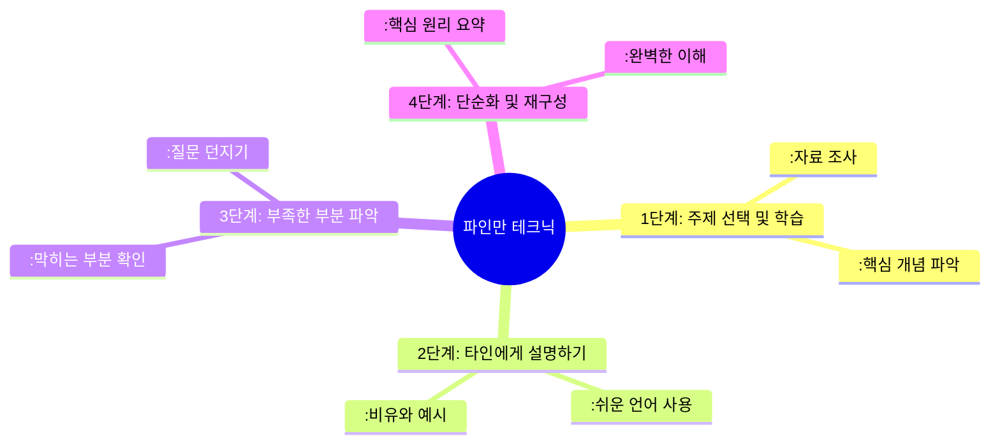

# 📋 2주차 퀘스트 기록 점검 및 개선안

## 1️⃣ 개발자에게 필요한 영어 단어 5개 추천받기

### 💡 배경 및 목적

- **배경**: JK님이 강조하신 지식의 상류층 접근과 공식 문서 활용의 중요성
- **목적**: 영어 원문 자료 독해 능력 향상으로 정확한 정보 습득

### ✅ 현재 퀘스트 평가

- ✅ **장점**: 공식 문서 등 영어 자료 읽기 능력 향상에 도움
- ✅ **효과**: 영어 단어 습득을 통한 원문 자료 접근성 개선
- 📸 **참고자료**: (슬랙 캡처 사진 추가 예정)

---

## 2️⃣ 프롬프트를 통한 학습, 설계, 구현 시간 분배하기

### 🤔 현재 퀘스트의 한계점

1. **순차적 진행의 현실성 문제**

   - 학습, 설계, 구현은 독립적 단계가 아닌 **상호 연결된 과정**
   - AI 추천 시간 분배의 실제 적용 어려움

2. **컨텍스트 스위칭 미고려**
   - 구현 중 지식 부족 발견 → 학습 단계로 복귀
   - 실제 미션은 단계 간 **동적 전환**이 빈번

### 💡 개선 방안

- **컨텍스트 스위칭을 고려한 시간 분배 방법** 도입
- 단계별 고정 시간이 아닌 **유연한 시간 배분 전략** 개발

---

## 3️⃣ "의심은 기술이다" – 근거 기반 디버깅 루틴

### ✅ 현재 방법론 평가

- ✅ **효과적인 검증 방법**:
  - 공식 문서 및 영어 자료 탐색
  - StackOverflow 등 커뮤니티 교차검증

### ⚠️ 부담 요소 및 개선안

- ❌ **과도한 부담 요소**:

  - 라이브러리 코드 분석
  - 단위 테스트 작성 (릴프 범주 초과)

- ✅ **개선된 범위**:
  - **검색 및 자료 조사 단계**까지로 제한
  - 일상적(routine) 수행 가능한 수준 유지

### 👥 팀 의견

> "라이브러리 코드 뜯기 / 단위 테스트 작성을 빼고 서치 단계까지만 하면 할만할 것 같다!"

---

## 4️⃣ 매일 배운 내용을 AI를 통해 정리하고 주 단위 연결고리 만들기

### ✅ 퀘스트 평가

- ✅ **전체적 평가**: 잘 설계된 퀘스트로 그대로 활용 가능
- ✅ **핵심 가치**: 학습 내용의 체계적 정리 및 연결고리 파악

### 🔧 기술적 개선안

#### 현재 문제점

- ❌ **마인드맵 시각화 한계**: 한글/영어 텍스트 깨짐 현상
- ❌ **이미지 품질 저하**: 효율적 리마인드 어려움

#### 해결 방안: Mermaid 활용

- 💡 **도구**: [mermaid.live](https://mermaid.live) 활용
- 💡 **형태**: SVG 형태 그래프로 고품질 시각화

#### 📊 Mermaid 마인드맵 예시

#### ⚠️ 주의사항

- 🎯 **파일 형식**: 반드시 **SVG 형태**로 저장
- ❌ **PNG 사용 금지**: 확대 시 품질 저하 및 용량 증가

---

#### 퀘스트 수행인원: J152신채은, J300황지현, J301황찬우, S015박현수

## 퀘스트 선정:

#### J152신채은:

- 수행 퀘스트:
- 선정 이유:
- 수행 계획:

#### J152신채은:

- 수행 퀘스트:
- 선정 이유:
- 수행 계획:

#### J152신채은:

- 수행 퀘스트:
- 선정 이유:
- 수행 계획:

#### J152신채은:

- 수행 퀘스트:
- 선정 이유:
- 수행 계획:

---

## 수행 결과: (2025.08.01 작성)

#### J152신채은

- 수행 내용:
- 느낀 점:

#### J152신채은

- 수행 내용:
- 느낀 점:

#### J152신채은

- 수행 내용:
- 느낀 점:

#### J152신채은

- 수행 내용:
- 느낀 점:
