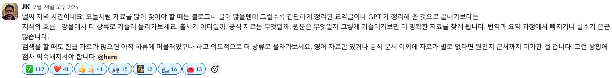

# 📋 2주차 퀘스트 기록 점검 및 개선안

## 1️⃣ 개발자에게 필요한 영어 단어 5개 추천받기

### 💡 배경 및 목적

- **배경**: JK님이 강조하신 지식의 상류층 접근과 공식 문서 활용의 중요성
- **목적**: 영어 원문 자료 독해 능력 향상으로 정확한 정보 습득

### ✅ 현재 퀘스트 평가

- ✅ **장점**: 공식 문서 등 영어 자료 읽기 능력 향상에 도움
- ✅ **효과**: 영어 단어 습득을 통한 원문 자료 접근성 개선
- 📸 **참고자료**
  

### 🧭 달성 기준
- 최소 1번, 원하는 만큼만 부담 없이 수행

### 🧭 수행 방법
- AI에게 개발자에게 필요한 영어 단어를 5개 추천 받고 기록하기

---

## 2️⃣ 프롬프트를 통한 학습, 설계, 구현 시간 분배하기

### 🤔 현재 퀘스트의 한계점

1. **순차적 진행의 현실성 문제**

   - 학습, 설계, 구현은 독립적 단계가 아닌 **상호 연결된 과정**
   - AI 추천 시간 분배의 실제 적용 어려움

2. **컨텍스트 스위칭 미고려**
   - 구현 중 지식 부족 발견 → 학습 단계로 복귀
   - 실제 미션은 단계 간 **동적 전환**이 빈번

### 💡 개선 방안

- **컨텍스트 스위칭을 고려한 시간 분배 방법** 도입
- 단계별 고정 시간이 아닌 **유연한 시간 배분 전략** 개발

### 🧭 달성 기준
- 

### 🧭 수행 방법
-

---

## 3️⃣ "의심은 기술이다" – 근거 기반 디버깅 루틴

### ✅ 현재 방법론 평가

- ✅ **효과적인 검증 방법**:
  - 공식 문서 및 영어 자료 탐색
  - StackOverflow 등 커뮤니티 교차검증

### ⚠️ 부담 요소 및 개선안

- ❌ **과도한 부담 요소**:

  - 라이브러리 코드 분석
  - 단위 테스트 작성 (릴프 범주 초과)

- ✅ **개선된 범위**:
  - **검색 및 자료 조사 단계**까지로 제한
  - 일상적(routine) 수행 가능한 수준 유지

### 👥 팀 의견

> "라이브러리 코드 뜯기 / 단위 테스트 작성을 빼고 서치 단계까지만 하면 할만할 것 같다!"

### 🧭 퀘스트 수행 절차
#### 1. ❓ 의심 포착하기

다음과 같은 상황이 발생했을 때 바로 기록한다:

- AI/블로그 답변이 **말이 안 되거나 이해되지 않을 때**
- “**이게 맞나?**” 라는 직감이 들 때
- **코드 실행 결과가 예상과 다를 때**
- 동료와 의견이 **갈릴 때**

> 기록 항목 예시
> 
> - 📌 상황 요약
> - 🤔 받은 답변/정보
> - 🔍 구체적으로 의심되는 포인트

#### 2. 🔬 검증 루틴 실행하기

| 검증 방법 | 설명 |
| --- | --- |
| 📘 **공식 문서 확인** | MDN, ECMAScript Spec, React Docs, Node.js Docs 등 |
| 💬 **커뮤니티 사례 탐색** | StackOverflow, GitHub issue, Reddit 등 |

#### 3. 📓 회고 템플릿 기록 예시

```markdown
### ❓ 의심한 내용
예: "JS에서 setTimeout 안에 async 함수를 넣으면 즉시 실행되나요?"

### 🤖 받은 정보
ChatGPT: "setTimeout(async () => {...})는 일정 시간 뒤에 실행됩니다."

### 🔍 검증한 과정
1. MDN 공식 문서에서 setTimeout 설명 확인
2. 실제 코드 테스트: 로그 순서 분석

### ✅ 최종 결론
- async 함수는 지연 후 실행되며 내부 await 타이밍은 별도
- 타이밍 흐름을 혼동하면 오해 가능

### 🧩 인사이트
- async/await의 실행 흐름은 microtask 큐 기준으로 작동
- 단순히 ‘async = 비동기’가 아님

```

---

## 4️⃣ 매일 배운 내용을 AI를 통해 정리하고 주 단위 연결고리 만들기

### ✅ 퀘스트 평가

- ✅ **전체적 평가**: 잘 설계된 퀘스트로 그대로 활용 가능
- ✅ **핵심 가치**: 학습 내용의 체계적 정리 및 연결고리 파악

### 🔧 기술적 개선안

#### 현재 문제점

- ❌ **마인드맵 시각화 한계**: 한글/영어 텍스트 깨짐 현상
- ❌ **이미지 품질 저하**: 효율적 리마인드 어려움

#### 해결 방안: Mermaid 활용

- 💡 **도구**: [mermaid.live](https://mermaid.live) 활용
- 💡 **형태**: SVG 형태 그래프로 고품질 시각화

#### 📊 Mermaid 마인드맵 예시


#### ⚠️ 주의사항

- 🎯 **파일 형식**: 반드시 **SVG 형태**로 저장
- ❌ **PNG 사용 금지**: 확대 시 품질 저하 및 용량 증가

### 🧭 퀘스트 수행 절차

```markdown
### 1. 핵심 개념 (Key Concept)
- 오늘 배운 내용 중 가장 중요하다고 생각하는 것 1~3가지

### 2. 나만의 언어로 설명하기 (Explain it to me like I'm five)
- 이 개념을 5살 아이에게 설명한다면? (Feynman Technique 활용)

### 3. 질문거리 (My Questions)
- 이 미션에서 꼭 이해해야될 부분을 질문으로 만들어줘!

### 4. 연결고리 (Connections)
- 오늘 배운 내용이 이전에 배운 어떤 것과 연결되는가?
```

1. 사용중인 AI에 채팅방을 새로 만들어 한주간 사용합니다.
2. 위의 템플릿과, 학습정리.md파일을 같이 첨부하여 “내가 첨부한 파일을 해당 스크립트를 기준으로 간단하게 정리해줘”라고 명령을 내리고 ‘질문거리’로 오늘의 공부를 리마인드 하고 마무리합니다!
3. "이번 주에 학습한 내용들의 '연결고리'를 참고해서, **개념들이 서로 어떻게 관련되어 있는지 마인드맵 형태로 설명해줘.**"라고 명령을 내려 마지막 날에 한 주간의 학습을 돌아보는 시간을 가집니다!


---

#### 퀘스트 수행인원: J152신채은, J300황지현, J301황찬우, S015박현수

## 퀘스트 선정:

#### J152신채은:

- 수행 퀘스트:
- 선정 이유:
- 수행 계획:

#### J152신채은:

- 수행 퀘스트:
- 선정 이유:
- 수행 계획:

#### J152신채은:

- 수행 퀘스트:
- 선정 이유:
- 수행 계획:

#### J152신채은:

- 수행 퀘스트:
- 선정 이유:
- 수행 계획:

---

## 수행 결과: (2025.08.01 작성)

#### J152신채은

- 수행 내용:
- 느낀 점:

#### J152신채은

- 수행 내용:
- 느낀 점:

#### J152신채은

- 수행 내용:
- 느낀 점:

#### J152신채은

- 수행 내용:
- 느낀 점:
